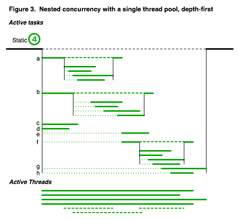

Conja
=====

_Incredibly easy functional concurrency in Java_

The purpose of Conja is to make it trivially easy for Java programmers to take advantage of multicore processors.  It basically wraps `java.utils.concurrent` in syntactic sugar that encourages a functional style.  It provides many of the same advantages that [jsr166y](http://gee.cs.oswego.edu/dl/concurrency-interest/) does (slated for inclusion in Java 7), though it's somewhat different under the hood.  Also, Conja seems to me to be easier to use :)

What it's not
-------------

Conja is not a JVM-based functional language like [Scala](http://www.scala-lang.org/) or [Clojure](http://clojure.org/); those are cool and all, but here we just want to make concurrent computation easy and efficient in pure Java.  Also, Conja does not provide distributed computation like [Hadoop](http://hadoop.apache.org/) or [Hazelcast](http://www.hazelcast.com/); it just exploits multiple cores on one machine, with no configuration and minimal code changes.  It has some of the same goals that Grand Central Dispatch aka [libdispatch](http://libdispatch.macosforge.org/) does for C-family languages, but Conja does not depend on kernel support or native libraries.  Also, where GCD and some other concurrency libraries use FIFO queues to schedule tasks, Conja can substantially reduce the memory requirements of your program through a prioritized task scheduling approach.

Overview
========

### Concurrent for-each

To parallelize your computation, just replace instances of for loops: 

```java
Iterable<T> someCollection = ...

for(T obj : someCollection) {
	doSomething(obj);
	}
```
	
with the `Parallel.forEach()` construct:

```java
Iterable<T> someCollection = ...

Parallel.forEach(someCollection, new Function<T, Void>() {
	void apply(T obj) {
		doSomething(obj);
		}
	});
```


As with any concurrent computation, the individual tasks should ideally have no side effects; if you follow this functional style then you don't ever need to think about thread synchronization, because the `Parallel` construct deals with it for you.  If you do want to change some external state from within each task, just make sure that the updates are thread-safe (e.g. if you're adding items to a `Set` use a `ConcurrentSkipListSet` rather than a regular `HashSet`).  It's OK to reference variables from the surrounding scope, but they must of course be `final`


### Mapping through a function

The cleanest way to store an output from each call is to use `Parallel.map()`:

```java
Map<T, V> results = Parallel.map(someCollection, new Function<T, V>(){
	V apply(T obj) {
		V result = doSomething(obj);
		return result;
		}
	});
```

### Iterate over anything

These constructs work on `Iterator`s or `Iterable`s (e.g. any `Collection`); there's also a variant that just repeats a task a given number of times, without providing an argument.

### Nested concurrent calls work fine

What if the `doSomething()` method itself performs a `Parallel.forEach()` somewhere inside it?  That's no problem at all, and is in fact encouraged.  Conja handles nested concurrency gracefully; the same worker threads are used on each call, so there is no proliferation of threads.  Conja internally prioritizes tasks to be executed based on depth-first ordering of the entire call tree, so that subtasks contributing to an earlier high-level task always preempt later high-level tasks and their subtasks.  Basically this means that it tries to finish one whole batch of tasks before starting (or continuing) on the next batch.  In fact, Conja does not even ''instantiate'' tasks (e.g., by calling `next()` on the task iterator) until near their execution time.  In combination these strategies help to conserve memory (or conversely, they help avoid out-of-memory errors for large computations).  (See [wiki:PrinciplesOfOperation Principles of Operation] for more details.)


Documentation
-------------

 * [API docs](http://davidsoergel.github.io/conja/)
 * [Principles of Operation](wiki:PrinciplesOfOperation)

Download
--------
[Maven](http://maven.apache.org/) is the easiest way to make use of conja.  Just add these to your pom.xml:

```xml
<repositories>
	<repository>
		<id>dev.davidsoergel.com releases</id>
		<url>http://dev.davidsoergel.com/nexus/content/repositories/releases</url>
		<snapshots>
			<enabled>false</enabled>
		</snapshots>
	</repository>
	<repository>
		<id>dev.davidsoergel.com snapshots</id>
		<url>http://dev.davidsoergel.com/nexus/content/repositories/snapshots</url>
		<releases>
			<enabled>false</enabled>
		</releases>
	</repository>
</repositories>

<dependencies>
	<dependency>
		<groupId>com.davidsoergel</groupId>
		<artifactId>conja</artifactId>
		<version>1.061</version>
	</dependency>
</dependencies>
```

If you really want just the jar, you can get the [latest release](http://dev.davidsoergel.com/nexus/content/repositories/releases/com/davidsoergel/conja/) from the Maven repo; or get the [latest stable build](http://dev.davidsoergel.com/jenkins/job/conja/lastStableBuild/com.davidsoergel$conja/) from the build server.

The only external dependency is on log4j, so if you don't use Maven, you'll need to grab that manually if it's not already in your classpath.


Principles of Operation
=======================

Conja helps to avoid a number of antipatterns in concurrent programming:

 * [Conflicts between incorrectly synchronized threads](#conflicts-between-incorrectly-synchronized-threads)
 * [Nested concurrency and proliferation of threads](#nested-concurrency-and-proliferation-of-threads)
 * [Suboptimal scheduling of nested tasks on the thread pool](#suboptimal-scheduling-of-nested-tasks-on-the-thread-pool)
 * [Proliferation of pending tasks](#proliferation-of-pending-tasks)
 * [Expensive task construction](#expensive-task-construction)


We'll illustrate points with diagrams like this:


Conflicts between incorrectly synchronized threads
--------------------------------------------------

### Antipattern

When different threads try to modify the same object, then either there is a race condition or, if the update is synchronized to avoid that, performance may suffer because the updates can't be done concurrently.

### Conja solution

Conja encourages a functional style, in which concurrent tasks do not have "side effects".  Their only inputs are provided at the outset, and their only outputs are stored when the task completes.  Conja handles the synchronization issues for the task inputs and outputs, so as long as you avoid side effects, you never need to worry about synchronizing anything.


Nested concurrency and proliferation of threads
-----------------------------------------------

### Antipattern

When you want to spawn a bunch of concurrent tasks, the first step is usually to make a thread pool on which to execute those tasks, e.g. via [http://java.sun.com/javase/6/docs/api/java/util/concurrent/Executors.html#newFixedThreadPool(int) Executors.newFixedThreadPool() ].  But if we're already in a concurrent task (on a worker thread) and do this for the sub-tasks, then we rapidly get gazillions of threads competing for resources (most dramatically if the concurrent calls are recursive).  This can easily produce out-of-memory errors, and degrades performance due to excessive context switching.


A solution is to use a single thread pool, but that raises several new questions: 1) how the pool is made available to the subtasks (it would be tedious to have to pass it around everywhere), and 2) how are the tasks scheduled on that pool?  The typical implementation places pending tasks in a FIFO queue; thus the tasks are executed in breadth-first order.  But then 3) what happens to worker threads that are waiting for a batch of subtasks to complete?  If the thread pool is fixed, this can quickly produce a deadlock, where all of the worker threads are waiting for tasks that can only be executed on those same threads.  But if the thread pool is expandable, we're back to the thread-proliferation situation.

Finally, note that a piece of code that wants to enqueue a bunch of parallel tasks usually has no way of knowing whether it is itself running in a thread pool or not, so dealing with these kinds of issues manually gets unwieldy pretty quickly.

### Conja solution

The user needn't be concerned about the thread pool at all, since Conja provides higher-level abstractions as static methods in [http://dev.davidsoergel.com/maven/conja/apidocs/com/davidsoergel/conja/Parallel.html Parallel].  Under the hood, Conja manages a singleton thread pool, initialized by default to the number of available cores.   Scheduling on the pool is depth-first and lazy (see below). While a thread is waiting for a batch of subtasks, the thread itself is available to execute those tasks (or any other tasks with a higher priority), avoiding deadlock due to insufficient threads.


Suboptimal scheduling of nested tasks on the thread pool
--------------------------------------------------------

### Antipattern

Tasks in an execution queue are typically executed in FIFO order.  In the case of nested concurrent tasks using a common queue, this means that tasks will be executed in breadth-first order: that is, all high-level tasks will be started before any of their subtasks are tackled.  The high-level tasks may be suspended by some mechanism while their subtasks complete, but they are nonetheless consuming memory during that time.  Thus, we may run out of memory. 


### Conja solution

Conja internally prioritizes tasks to be executed based on depth-first ordering of the entire call tree, so that subtasks contributing to an earlier high-level task always preempt later high-level tasks and their subtasks. Basically this means that it tries to finish one whole batch of tasks before starting (or continuing) on the next batch (for instance, tasks ''a'' and ''b'' finish sooner in Fig. 3 than in Fig 2, and tasks ''e-h'' start later).  Thus, the memory required for the earlier high-level tasks and their subtasks can be freed before later high-level tasks are even instantiated (see also [#expensiveNext Expensive task construction] below).  This is a "streaming" approach that minimizes the memory footprint, somewhat analogous to using an `Iterator` instead of a `Collection`.




Proliferation of pending tasks
------------------------------

### Antipattern

In Java, placing tasks in a queue for execution requires instantiating a `Runnable` object of some kind.  Imagine a situation where we want to perform some task on each of one million Strings.  A naive thing to do would be to instantiate all million `Runnable`s, place them in a queue, and provide that queue to an `Executor`.  In the above figures, this means that each of the lightly dotted "pending" lines carries a memory cost, so we'll quickly run out of memory doing that.  This is true even in a producer-consumer situation where the thread pool is executing tasks from the beginning of the queue while they're being added to the end, since the enqueuing operation is usually much faster than the actual task execution (otherwise concurrency would be pointless).  Enqueuing too many tasks can be avoided by using a properly configured blocking queue, but it can be tedious and error-prone to handle this manually all the time.

### Conja solution

Conja provides just-in-time instantiation of the `Runnable` objects to be executed.  That is, it keeps a small number of `Runnable` objects in the execution queue (just enough to keep the worker threads busy), and doesn't call `next()` on the input iterator to construct a new `Runnable` until there's space in the queue (i.e., when it's nearly time to execute the task).  This is again a "streaming" approach that avoids using lots of memory for pending tasks, and is especially useful if the input `Iterator` is itself a streaming kind of thing (i.e., if it reads a large data set from disk that doesn't fit in memory).

Expensive task construction
---------------------------

### Antipattern

In some cases, the task inputs may come not from a simple Collection but from some Iterator that does something complicated every time you call `next()`.  In this case, a single producer thread (which constructs a Runnable for each next()) would be a bottleneck and the worker threads would be starved.

### Conja solution

In Conja, the `next()` call itself is done from each worker thread, not on some producer thread.  Normally the call is synchronized on the iterator itself; in the case of an expensive `next()`, this just reconstitutes the bottleneck.  However, the `Parallel.forEach()` and `Parallel.map()` methods also accept a [http://dev.davidsoergel.com/maven/conja/apidocs/com/davidsoergel/conja/ThreadSafeNextOnlyIterator.html ThreadSafeNextOnlyIterator] instead of a regular Iterator.  If you want to provide an iterator with an expensive next() operation, just implement that interface and ensure that the next() call is thread-safe.

A common case is the [http://dev.davidsoergel.com/maven/conja/apidocs/com/davidsoergel/conja/MappingThreadSafeNextOnlyIterator.html MappingThreadSafeNextOnlyIterator], which applies some function to each element from an underlying iterator.  In this case the call to the underlying iterator may need to be synchronized, but the mapping function (which is likely the expensive part anyway) can be executed in parallel.

